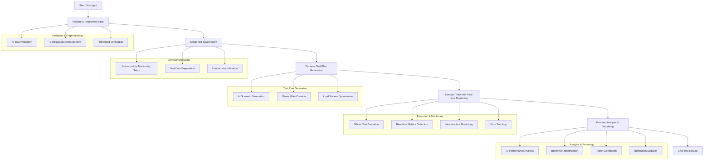
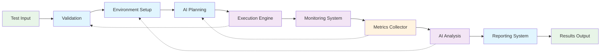

# AI Performance Testing System - Workflow Orchestration

## Overview

The AI Performance Testing System implements a sophisticated workflow orchestration mechanism that coordinates the complete performance testing lifecycle. This document details the five core components of the workflow orchestration system and how they work together to deliver comprehensive performance testing capabilities.

## Workflow Components

### 1. Test Validation and Preprocessing

**Purpose**: AI-powered validation and enhancement of test configurations

**Key Features**:
- Automated validation of test parameters using LLM analysis
- Configuration enhancement with default values and best practices
- Threshold verification against industry standards
- Identification of potential configuration issues
- Optimization suggestions for better test coverage

**Implementation Details**:
```python
async def validate_and_preprocess_input(self, test_input: TestInput) -> TestInput:
    """Step 1: Validate input and prepare test environment"""
    # AI-powered input validation
    validation_prompt = f"""
    Validate this performance test configuration: {json.dumps(asdict(test_input), indent=2)}
    
    Check for:
    1. Realistic load patterns
    2. Appropriate thresholds
    3. Missing configurations
    4. Potential issues
    5. Optimization opportunities
    
    Return validation results and suggested improvements.
    """
    
    response = self.llm.invoke([HumanMessage(content=validation_prompt)])
    
    # Preprocess and enhance the input
    preprocessed_input = self._preprocess_test_input(test_input)
    
    return preprocessed_input
```

### 2. Environment Setup and Connectivity Checks

**Purpose**: Preparation of test environment and validation of system connectivity

**Key Features**:
- Infrastructure monitoring setup (CPU, memory, disk, network)
- Database connection validation
- Redis and cache system connectivity checks
- Test data preparation and parameterization
- Environment isolation and cleanup procedures

**Implementation Details**:
```python
async def setup_test_environment(self, test_input: TestInput):
    """Step 2: Setup test environment and validate connectivity"""
    # Setup infrastructure monitoring
    self._setup_infrastructure_monitoring(test_input.environment)
    
    # Prepare test data
    self._setup_test_data(test_input)
    
    # Validate environment connectivity
    connectivity_results = await self._validate_environment_connectivity(test_input)
    
    return {
        "environment_ready": True,
        "connectivity_results": connectivity_results
    }
```

### 3. Dynamic Test Plan Generation

**Purpose**: AI-driven generation of comprehensive test scenarios and JMeter plans

**Key Features**:
- Intelligent scenario generation based on test objectives
- Dynamic JMeter test plan creation with optimal configurations
- Load pattern optimization for realistic simulations
- Edge case and failure scenario inclusion
- User journey modeling for realistic testing

**Implementation Details**:
```python
async def generate_dynamic_test_plans(self, test_input: TestInput) -> List[Dict]:
    """Step 3: AI-enhanced dynamic test plan generation"""
    scenario_prompt = f"""
    Generate comprehensive performance test scenarios for: {test_input.test_name}
    
    Based on:
    - Test type: {test_input.test_type.value}
    - Endpoints: {[ep.name for ep in test_input.endpoints]}
    - Load patterns: {[lp.name for lp in test_input.load_patterns]}
    
    Create:
    1. Realistic user journey scenarios
    2. Edge case testing scenarios
    3. Failure condition scenarios
    4. Scalability progression scenarios
    5. Data-driven test scenarios
    
    Include specific JMeter configurations for each scenario.
    """
    
    response = self.llm.invoke([HumanMessage(content=scenario_prompt)])
    
    # Generate JMeter test plans
    ai_scenarios = json.loads(response.content)
    jmeter_plans = self._generate_comprehensive_jmx_files(test_input, ai_scenarios)
    
    return {
        "ai_scenarios": ai_scenarios,
        "jmeter_plans": jmeter_plans
    }
```

### 4. Real-time Monitoring During Execution

**Purpose**: Continuous monitoring and metrics collection during test execution

**Key Features**:
- Live performance metrics collection
- Infrastructure resource utilization tracking
- Error and exception monitoring
- Real-time alerting for critical issues
- Dynamic test adjustment based on performance feedback

**Implementation Details**:
```python
async def execute_with_real_time_monitoring(self, test_plans: List[Dict]) -> List[TestResult]:
    """Step 4: Execute tests with real-time monitoring"""
    execution_results = []
    
    for plan in test_plans:
        # Start infrastructure monitoring
        self._start_monitoring(test_input.environment)
        
        # Execute JMeter test with monitoring
        result = self._execute_jmeter_test_with_monitoring(plan, test_input)
        
        # Stop monitoring and collect data
        infra_metrics = self._collect_infrastructure_metrics(test_input.environment)
        
        # Enhance result with monitoring data
        enhanced_result = self._enhance_test_result(result, infra_metrics)
        execution_results.append(enhanced_result)
    
    return {"execution_results": execution_results}
```

### 5. Post-test Analysis and Reporting

**Purpose**: Comprehensive AI analysis of test results and report generation

**Key Features**:
- AI-powered performance bottleneck identification
- Statistical analysis of metrics and trends
- Comparative analysis against benchmarks and previous runs
- Automated report generation in multiple formats
- Actionable optimization recommendations
- Risk assessment and capacity planning

**Implementation Details**:
```python
async def post_test_analysis_and_reporting(self, results: List[TestResult]) -> AIInsights:
    """Step 5: Comprehensive AI analysis of all results"""
    analysis_prompt = f"""
    Perform comprehensive analysis of these performance test results:
    
    Test Configuration: {json.dumps(asdict(test_input), default=str, indent=2)}
    Results: {json.dumps([asdict(r) for r in results], default=str, indent=2)}
    
    Provide detailed analysis including:
    
    1. EXECUTIVE SUMMARY
    - Overall performance assessment
    - Key business impact
    - Go/No-go recommendation
    
    2. TECHNICAL ANALYSIS
    - Bottleneck identification with root causes
    - Performance patterns and trends
    - Scalability assessment
    - Infrastructure utilization analysis
    
    3. RISK ASSESSMENT
    - Production readiness
    - Potential failure points
    - Capacity limits
    
    4. OPTIMIZATION ROADMAP
    - Immediate fixes (0-2 weeks)
    - Short-term improvements (1-3 months)
    - Long-term optimizations (3+ months)
    - ROI estimates for each
    
    5. CAPACITY PLANNING
    - Current capacity limits
    - Scaling recommendations
    - Infrastructure requirements
    - Cost projections
    
    6. COMPARATIVE ANALYSIS
    - Industry benchmarks
    - Previous test comparisons
    - Performance trends
    
    Provide specific, actionable recommendations with technical details.
    """
    
    response = self.llm.invoke([HumanMessage(content=analysis_prompt)])
    
    # Parse AI insights
    ai_insights = self._parse_ai_insights(response.content)
    
    # Generate reports and artifacts
    reports = self._generate_all_report_formats(test_input, results, ai_insights)
    artifacts = self._create_test_artifacts(test_input, results, ai_insights)
    
    # Send notifications
    self._send_notifications(test_input, results, ai_insights)
    
    return {
        "comprehensive_analysis": response.content,
        "ai_insights": ai_insights,
        "generated_reports": reports,
        "artifacts": artifacts
    }
```

## Workflow Architecture

The workflow orchestration follows a sequential pattern with clear dependencies between components:



## Component Interaction Flow

The components interact in a coordinated manner with feedback loops for optimization:



## Benefits of the Workflow Orchestration

### Intelligence
- AI-powered test configuration validation
- Intelligent scenario generation
- Automated bottleneck identification
- Predictive performance analysis

### Automation
- End-to-end test execution
- Automatic environment setup
- Self-healing test processes
- Automated report generation

### Monitoring
- Real-time performance metrics
- Infrastructure resource tracking
- Dynamic alerting system
- Continuous feedback loops

### Scalability
- Distributed test execution
- Elastic resource allocation
- Parallel scenario testing
- Cloud-native architecture

## Implementation Considerations

### Error Handling
Each workflow component includes robust error handling to ensure graceful degradation and informative error reporting.

### State Management
The workflow maintains state between components to ensure continuity and enable rollback capabilities when needed.

### Extensibility
The modular design allows for easy extension of individual components without affecting the overall workflow structure.

### Performance
Asynchronous execution patterns are used throughout to maximize efficiency and minimize resource contention.

## Conclusion

The workflow orchestration system provides a comprehensive framework for AI-driven performance testing that combines the power of machine learning with robust automation capabilities. By coordinating the five key components in a structured sequence, the system delivers reliable, insightful, and actionable performance testing results that help organizations optimize their applications for peak performance.